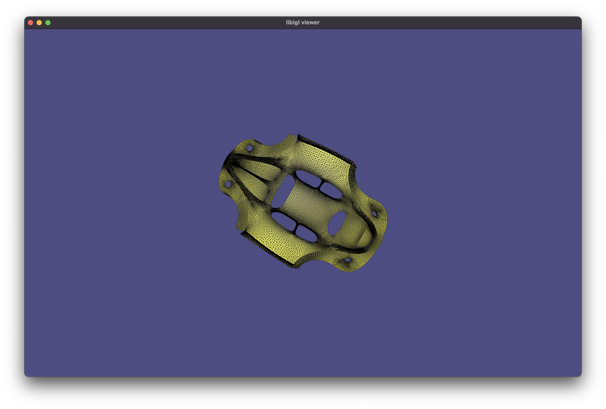

# libigl 🤝 Spectra

A small example project mixing [libigl](https://github.com/libigl/libigl/) and
[spectra](https://github.com/yixuan/spectra).

## Compile

Compile this project using the standard cmake routine:

    mkdir build
    cd build
    cmake ..
    make

This should find and build the dependencies and create a `example` binary.

## Run

From within the `build` directory just issue:

    ./example

A glfw app should launch displaying a UV flattened beetle.

